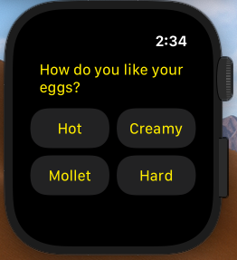
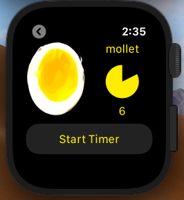
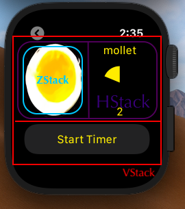

# PerfectEgg 
[]() 
[]() 
[]() 
[]()


Perfect Egg is a WatchOS app developed with SwiftUI that helps us to boil a Perfect Egg, every single time.

## Installing / Getting started

Just open and run on Xcode

I've used Xcode 11.7 and an Apple Watch Series 5 to run this project.

## Developing

### Languages
Swift Language and SwiftUI for the GUI. 

### Built With

I've developed this simple project with the **MVI (Model-View-Intent)** pattern in mind.

MVI is a pattern that goes well with reactive programming and that matches SwiftUI to perfection.

#### Model - EggModel.Swift
Our Model is a simple array of cards (eggs) working like a Stack. Card is an identifiable Struct that represents an egg.

Eggs are organized in a Stack from the least boiled egg (an raw egg) to the most boiled egg (a "too much" egg). 
As the timer passes by, our eggs (and therefore our model) is changed by the mutating goToNextEgg() function that acted like a pop in the Stack.

#### Views - ContentView and StartView

* StartView.Swift

  * StartView is the first view the user sees. There, you can chose how you want your eggs to be boiled and start the timer.


* ContentView.Swift

  * ContentView is a view that uses several SwiftUI stacks, on on top of the other to represent the eggs being boiled. 
  In this view we use @ObservedObject to manage state of our ViewModel
  ```swift
  @ObservedObject var vmEgg: EggVM
  ```
  

  The outermost Stack is a Vertical Stack (VStack) cointaining a HorizontalStack (HStack) on top and a button to start a new timer on bottom.

  The HStack itself, contains a ZStack on left (a stack of eggs, represented to us as "cards") and a timer on right. The right portion also shows info about the type of egg
being boiled right now (ex: hot, mollet, hard, etc.) and the time in seconds left till this egg constistency will be ready to enjoy!

  

#### ViewModel -EggVM.Swift

In our viewModel we use @Published property wrapper on our Model variable for our views to update when they change.

```swift
@Published private var timer : EggModel<String> = EggVM.createEggs()
```

The view model also lists the intents of our user, and they are as simple as it gets: just to go to the next boiled egg point when our 
timer reaches the configured time for that specific type of egg being displayed in our view

## Licensing

MIT
